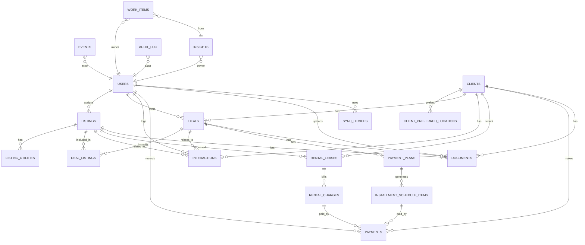

# Canonical Neon Postgres DDL

Source: https://app.notion.com/p/772afe18592c435f9a58816c6e220ec1

## Status

This is the implementation authority for the database. It normalizes earlier schema drafts and adds production companions for sync, audit, analytics, and workflow.

## Normalization Decisions

- `listings.utilities` is normalized into `listing_utilities`.
- `clients.preferred_locations` is normalized into `client_preferred_locations`.
- `deals.primary_listing_id` is replaced by `deal_listings` so a deal can include multiple listings.
- `sync_devices` and `sync_state` govern offline sync.
- `audit_log` is maintained in addition to the analytics `events` stream.
- Soft deletes use `deleted_at` where operational records may need recovery or audit continuity.

## ER Diagram



## Definitive Schema

```sql
CREATE EXTENSION IF NOT EXISTS "pgcrypto";

CREATE TYPE user_role AS ENUM ('admin','agent','finance','legal','auditor');

CREATE TYPE listing_type AS ENUM ('property','vacant_land');
CREATE TYPE availability_status AS ENUM ('available','reserved','under_maintenance','rented','sold');
CREATE TYPE currency_code AS ENUM ('ZMW','USD');
CREATE TYPE zoning_type AS ENUM ('residential','commercial','agricultural','mixed','other');
CREATE TYPE land_designation AS ENUM ('state_land','customary_land');

CREATE TYPE client_segment AS ENUM ('prospective_buyer','active_tenant','land_owner_seller','past_lead');
CREATE TYPE interaction_type AS ENUM ('call','site_visit','whatsapp','email','negotiation','other');
CREATE TYPE deal_stage AS ENUM ('lead','viewing','offer','contract','closed_won','closed_lost');
CREATE TYPE deal_type AS ENUM ('sale','rental','installment');
CREATE TYPE plan_frequency AS ENUM ('monthly','quarterly','custom');
CREATE TYPE plan_status AS ENUM ('active','completed','cancelled');
CREATE TYPE item_status AS ENUM ('due','paid','overdue');
CREATE TYPE lease_status AS ENUM ('active','ended');

CREATE TYPE doc_category AS ENUM (
  'title_deed','offer_letter','survey_diagram','site_plan',
  'contract_of_sale','lease_agreement','other'
);

CREATE TYPE insight_severity AS ENUM ('info','warn','critical');
CREATE TYPE insight_status AS ENUM ('open','acknowledged','resolved','dismissed');
CREATE TYPE work_status AS ENUM ('to_do','doing','done','blocked');
CREATE TYPE work_priority AS ENUM ('low','medium','high');
CREATE TYPE audit_action AS ENUM ('insert','update','delete');
CREATE TYPE entity_type AS ENUM (
  'user','listing','client','deal','interaction','document','payment',
  'lease','charge','schedule_item','payment_plan','insight','work_item'
);
CREATE TYPE utility_type AS ENUM ('water','electricity','sewer','internet');

CREATE TABLE users (
  id uuid PRIMARY KEY DEFAULT gen_random_uuid(),
  clerk_user_id text NOT NULL UNIQUE,
  email text,
  full_name text,
  role user_role NOT NULL,
  is_active boolean NOT NULL DEFAULT true,
  created_at timestamptz NOT NULL DEFAULT now(),
  updated_at timestamptz NOT NULL DEFAULT now()
);

CREATE TABLE listings (
  id uuid PRIMARY KEY DEFAULT gen_random_uuid(),
  listing_code text NOT NULL UNIQUE,
  type listing_type NOT NULL,
  availability_status availability_status NOT NULL,
  location_area text NOT NULL,
  address text,
  asking_price_amount numeric(14,2),
  asking_price_currency currency_code,
  bedrooms integer,
  bathrooms integer,
  land_size_ha numeric(12,4),
  zoning zoning_type,
  land_designation land_designation,
  assigned_agent_user_id uuid REFERENCES users(id) ON DELETE SET NULL,
  internal_notes text,
  created_at timestamptz NOT NULL DEFAULT now(),
  updated_at timestamptz NOT NULL DEFAULT now(),
  last_modified_by_user_id uuid REFERENCES users(id) ON DELETE SET NULL,
  deleted_at timestamptz
);

CREATE INDEX listings_status_idx ON listings (availability_status);
CREATE INDEX listings_location_idx ON listings (location_area);
CREATE INDEX listings_type_idx ON listings (type);
CREATE INDEX listings_agent_idx ON listings (assigned_agent_user_id);
CREATE INDEX listings_location_status_idx ON listings (location_area, availability_status);
CREATE INDEX listings_not_deleted_idx ON listings (deleted_at) WHERE deleted_at IS NULL;

CREATE TABLE listing_utilities (
  listing_id uuid NOT NULL REFERENCES listings(id) ON DELETE CASCADE,
  utility utility_type NOT NULL,
  created_at timestamptz NOT NULL DEFAULT now(),
  PRIMARY KEY (listing_id, utility)
);

CREATE TABLE clients (
  id uuid PRIMARY KEY DEFAULT gen_random_uuid(),
  full_name text NOT NULL,
  phone text,
  email text,
  segment client_segment NOT NULL,
  nrc_number text,
  passport_number text,
  tpin text,
  nationality text,
  budget_min_amount numeric(14,2),
  budget_max_amount numeric(14,2),
  budget_currency currency_code,
  notes text,
  created_at timestamptz NOT NULL DEFAULT now(),
  updated_at timestamptz NOT NULL DEFAULT now(),
  last_modified_by_user_id uuid REFERENCES users(id) ON DELETE SET NULL,
  deleted_at timestamptz
);

CREATE INDEX clients_segment_idx ON clients (segment);
CREATE INDEX clients_name_idx ON clients (full_name);
CREATE INDEX clients_phone_idx ON clients (phone);
CREATE INDEX clients_email_idx ON clients (email);
CREATE INDEX clients_tpin_idx ON clients (tpin);
CREATE INDEX clients_nrc_idx ON clients (nrc_number);
CREATE INDEX clients_not_deleted_idx ON clients (deleted_at) WHERE deleted_at IS NULL;

CREATE TABLE client_preferred_locations (
  client_id uuid NOT NULL REFERENCES clients(id) ON DELETE CASCADE,
  location_area text NOT NULL,
  created_at timestamptz NOT NULL DEFAULT now(),
  PRIMARY KEY (client_id, location_area)
);

CREATE TABLE deals (
  id uuid PRIMARY KEY DEFAULT gen_random_uuid(),
  deal_name text NOT NULL,
  stage deal_stage NOT NULL,
  deal_type deal_type NOT NULL,
  client_id uuid NOT NULL REFERENCES clients(id) ON DELETE RESTRICT,
  offer_amount numeric(14,2),
  offer_currency currency_code,
  expected_close_at timestamptz,
  closed_at timestamptz,
  agent_user_id uuid NOT NULL REFERENCES users(id) ON DELETE RESTRICT,
  commission_percent numeric(5,2),
  commission_amount numeric(14,2),
  notes text,
  created_at timestamptz NOT NULL DEFAULT now(),
  updated_at timestamptz NOT NULL DEFAULT now(),
  last_modified_by_user_id uuid REFERENCES users(id) ON DELETE SET NULL,
  deleted_at timestamptz
);

CREATE INDEX deals_stage_idx ON deals (stage);
CREATE INDEX deals_type_idx ON deals (deal_type);
CREATE INDEX deals_client_idx ON deals (client_id);
CREATE INDEX deals_agent_idx ON deals (agent_user_id);
CREATE INDEX deals_expected_close_idx ON deals (expected_close_at);
CREATE INDEX deals_not_deleted_idx ON deals (deleted_at) WHERE deleted_at IS NULL;

CREATE TABLE deal_listings (
  deal_id uuid NOT NULL REFERENCES deals(id) ON DELETE CASCADE,
  listing_id uuid NOT NULL REFERENCES listings(id) ON DELETE RESTRICT,
  created_at timestamptz NOT NULL DEFAULT now(),
  PRIMARY KEY (deal_id, listing_id)
);

CREATE INDEX deal_listings_listing_idx ON deal_listings (listing_id);

CREATE TABLE interactions (
  id uuid PRIMARY KEY DEFAULT gen_random_uuid(),
  summary text NOT NULL,
  client_id uuid NOT NULL REFERENCES clients(id) ON DELETE RESTRICT,
  listing_id uuid REFERENCES listings(id) ON DELETE SET NULL,
  deal_id uuid REFERENCES deals(id) ON DELETE SET NULL,
  type interaction_type NOT NULL,
  outcome text,
  interaction_at timestamptz NOT NULL,
  next_step text,
  next_follow_up_at timestamptz,
  agent_user_id uuid NOT NULL REFERENCES users(id) ON DELETE RESTRICT,
  created_at timestamptz NOT NULL DEFAULT now(),
  updated_at timestamptz NOT NULL DEFAULT now(),
  deleted_at timestamptz
);

CREATE INDEX interactions_client_idx ON interactions (client_id);
CREATE INDEX interactions_listing_idx ON interactions (listing_id);
CREATE INDEX interactions_deal_idx ON interactions (deal_id);
CREATE INDEX interactions_agent_idx ON interactions (agent_user_id);
CREATE INDEX interactions_at_idx ON interactions (interaction_at);
CREATE INDEX interactions_follow_up_idx ON interactions (next_follow_up_at);
CREATE INDEX interactions_not_deleted_idx ON interactions (deleted_at) WHERE deleted_at IS NULL;

CREATE TABLE payment_plans (
  id uuid PRIMARY KEY DEFAULT gen_random_uuid(),
  plan_name text NOT NULL,
  deal_id uuid NOT NULL REFERENCES deals(id) ON DELETE RESTRICT,
  client_id uuid NOT NULL REFERENCES clients(id) ON DELETE RESTRICT,
  principal_amount numeric(14,2) NOT NULL,
  down_payment_amount numeric(14,2) NOT NULL,
  currency currency_code NOT NULL,
  frequency plan_frequency NOT NULL,
  periods integer NOT NULL,
  start_date date NOT NULL,
  status plan_status NOT NULL,
  created_at timestamptz NOT NULL DEFAULT now(),
  updated_at timestamptz NOT NULL DEFAULT now(),
  last_modified_by_user_id uuid REFERENCES users(id) ON DELETE SET NULL,
  deleted_at timestamptz
);

CREATE INDEX payment_plans_deal_idx ON payment_plans (deal_id);
CREATE INDEX payment_plans_client_idx ON payment_plans (client_id);
CREATE INDEX payment_plans_status_idx ON payment_plans (status);

CREATE TABLE installment_schedule_items (
  id uuid PRIMARY KEY DEFAULT gen_random_uuid(),
  payment_plan_id uuid NOT NULL REFERENCES payment_plans(id) ON DELETE CASCADE,
  installment_number integer NOT NULL,
  due_date date NOT NULL,
  amount_due numeric(14,2) NOT NULL,
  amount_paid numeric(14,2) NOT NULL DEFAULT 0,
  paid_at timestamptz,
  status item_status NOT NULL,
  created_at timestamptz NOT NULL DEFAULT now(),
  updated_at timestamptz NOT NULL DEFAULT now(),
  CONSTRAINT installment_unique_number UNIQUE (payment_plan_id, installment_number)
);

CREATE INDEX installment_due_idx ON installment_schedule_items (due_date);
CREATE INDEX installment_status_idx ON installment_schedule_items (status);

CREATE TABLE rental_leases (
  id uuid PRIMARY KEY DEFAULT gen_random_uuid(),
  lease_name text NOT NULL,
  tenant_client_id uuid NOT NULL REFERENCES clients(id) ON DELETE RESTRICT,
  listing_id uuid NOT NULL REFERENCES listings(id) ON DELETE RESTRICT,
  start_date date NOT NULL,
  end_date date,
  rent_amount numeric(14,2) NOT NULL,
  currency currency_code NOT NULL,
  billing_day integer NOT NULL,
  deposit_amount numeric(14,2),
  status lease_status NOT NULL,
  created_at timestamptz NOT NULL DEFAULT now(),
  updated_at timestamptz NOT NULL DEFAULT now(),
  last_modified_by_user_id uuid REFERENCES users(id) ON DELETE SET NULL,
  deleted_at timestamptz,
  CONSTRAINT billing_day_range CHECK (billing_day >= 1 AND billing_day <= 28)
);

CREATE INDEX leases_tenant_idx ON rental_leases (tenant_client_id);
CREATE INDEX leases_listing_idx ON rental_leases (listing_id);
CREATE INDEX leases_status_idx ON rental_leases (status);

CREATE TABLE rental_charges (
  id uuid PRIMARY KEY DEFAULT gen_random_uuid(),
  lease_id uuid NOT NULL REFERENCES rental_leases(id) ON DELETE CASCADE,
  period_month date NOT NULL,
  due_date date NOT NULL,
  amount numeric(14,2) NOT NULL,
  currency currency_code NOT NULL,
  status item_status NOT NULL,
  created_at timestamptz NOT NULL DEFAULT now(),
  updated_at timestamptz NOT NULL DEFAULT now(),
  CONSTRAINT rental_charge_unique_month UNIQUE (lease_id, period_month)
);

CREATE INDEX rental_charges_due_idx ON rental_charges (due_date);
CREATE INDEX rental_charges_status_idx ON rental_charges (status);

CREATE TABLE payments (
  id uuid PRIMARY KEY DEFAULT gen_random_uuid(),
  receipt_number text UNIQUE,
  client_id uuid NOT NULL REFERENCES clients(id) ON DELETE RESTRICT,
  deal_id uuid REFERENCES deals(id) ON DELETE SET NULL,
  payment_plan_id uuid REFERENCES payment_plans(id) ON DELETE SET NULL,
  installment_schedule_item_id uuid REFERENCES installment_schedule_items(id) ON DELETE SET NULL,
  lease_id uuid REFERENCES rental_leases(id) ON DELETE SET NULL,
  rental_charge_id uuid REFERENCES rental_charges(id) ON DELETE SET NULL,
  paid_at timestamptz NOT NULL,
  amount numeric(14,2) NOT NULL,
  currency currency_code NOT NULL,
  method text,
  notes text,
  created_at timestamptz NOT NULL DEFAULT now(),
  updated_at timestamptz NOT NULL DEFAULT now(),
  recorded_by_user_id uuid NOT NULL REFERENCES users(id) ON DELETE RESTRICT
);

CREATE INDEX payments_client_idx ON payments (client_id);
CREATE INDEX payments_deal_idx ON payments (deal_id);
CREATE INDEX payments_paid_at_idx ON payments (paid_at);

CREATE TABLE documents (
  id uuid PRIMARY KEY DEFAULT gen_random_uuid(),
  document_name text NOT NULL,
  category doc_category NOT NULL,
  listing_id uuid REFERENCES listings(id) ON DELETE SET NULL,
  client_id uuid REFERENCES clients(id) ON DELETE SET NULL,
  deal_id uuid REFERENCES deals(id) ON DELETE SET NULL,
  blob_url text NOT NULL,
  blob_key text,
  mime_type text,
  file_size_bytes bigint,
  is_verified boolean NOT NULL DEFAULT false,
  verified_at timestamptz,
  verified_by_user_id uuid REFERENCES users(id) ON DELETE SET NULL,
  notes text,
  created_at timestamptz NOT NULL DEFAULT now(),
  updated_at timestamptz NOT NULL DEFAULT now(),
  uploaded_by_user_id uuid REFERENCES users(id) ON DELETE SET NULL,
  deleted_at timestamptz
);

CREATE INDEX documents_category_idx ON documents (category);
CREATE INDEX documents_listing_idx ON documents (listing_id);
CREATE INDEX documents_client_idx ON documents (client_id);
CREATE INDEX documents_deal_idx ON documents (deal_id);
CREATE INDEX documents_verified_idx ON documents (is_verified);

CREATE TABLE sync_devices (
  id uuid PRIMARY KEY DEFAULT gen_random_uuid(),
  device_id text NOT NULL UNIQUE,
  user_id uuid NOT NULL REFERENCES users(id) ON DELETE RESTRICT,
  device_type text NOT NULL,
  app_version text,
  last_seen_at timestamptz,
  created_at timestamptz NOT NULL DEFAULT now(),
  updated_at timestamptz NOT NULL DEFAULT now()
);

CREATE INDEX sync_devices_user_idx ON sync_devices (user_id);

CREATE TABLE sync_state (
  device_id uuid PRIMARY KEY REFERENCES sync_devices(id) ON DELETE CASCADE,
  last_sync_token text,
  last_sync_at timestamptz,
  last_error_code text,
  last_error_at timestamptz,
  consecutive_failures integer NOT NULL DEFAULT 0,
  updated_at timestamptz NOT NULL DEFAULT now()
);

CREATE TABLE events (
  id uuid PRIMARY KEY DEFAULT gen_random_uuid(),
  event_type text NOT NULL,
  occurred_at timestamptz NOT NULL,
  actor_user_id uuid REFERENCES users(id) ON DELETE SET NULL,
  entity_type entity_type NOT NULL,
  entity_id uuid,
  metadata jsonb,
  created_at timestamptz NOT NULL DEFAULT now()
);

CREATE INDEX events_type_idx ON events (event_type);
CREATE INDEX events_occurred_at_idx ON events (occurred_at);
CREATE INDEX events_actor_idx ON events (actor_user_id);
CREATE INDEX events_entity_idx ON events (entity_type, entity_id);

CREATE TABLE audit_log (
  id uuid PRIMARY KEY DEFAULT gen_random_uuid(),
  action audit_action NOT NULL,
  occurred_at timestamptz NOT NULL DEFAULT now(),
  actor_user_id uuid REFERENCES users(id) ON DELETE SET NULL,
  entity_type entity_type NOT NULL,
  entity_id uuid,
  before_data jsonb,
  after_data jsonb,
  request_id text,
  source text,
  ip_address inet,
  user_agent text
);

CREATE INDEX audit_log_occurred_idx ON audit_log (occurred_at);
CREATE INDEX audit_log_actor_idx ON audit_log (actor_user_id);
CREATE INDEX audit_log_entity_idx ON audit_log (entity_type, entity_id);

CREATE TABLE insights (
  id uuid PRIMARY KEY DEFAULT gen_random_uuid(),
  insight_type text NOT NULL,
  severity insight_severity NOT NULL,
  title text NOT NULL,
  description text,
  owner_user_id uuid REFERENCES users(id) ON DELETE SET NULL,
  status insight_status NOT NULL,
  entity_type entity_type,
  entity_id uuid,
  evidence jsonb,
  recommended_action text,
  due_at timestamptz,
  created_at timestamptz NOT NULL DEFAULT now(),
  updated_at timestamptz NOT NULL DEFAULT now()
);

CREATE INDEX insights_status_idx ON insights (status);
CREATE INDEX insights_severity_idx ON insights (severity);
CREATE INDEX insights_owner_idx ON insights (owner_user_id);
CREATE INDEX insights_entity_idx ON insights (entity_type, entity_id);

CREATE TABLE work_items (
  id uuid PRIMARY KEY DEFAULT gen_random_uuid(),
  work_type text NOT NULL,
  title text NOT NULL,
  description text,
  status work_status NOT NULL,
  priority work_priority NOT NULL,
  owner_user_id uuid REFERENCES users(id) ON DELETE SET NULL,
  related_insight_id uuid REFERENCES insights(id) ON DELETE SET NULL,
  entity_type entity_type,
  entity_id uuid,
  due_at timestamptz,
  completed_at timestamptz,
  created_at timestamptz NOT NULL DEFAULT now(),
  updated_at timestamptz NOT NULL DEFAULT now()
);

CREATE INDEX work_items_status_idx ON work_items (status);
CREATE INDEX work_items_priority_idx ON work_items (priority);
CREATE INDEX work_items_owner_idx ON work_items (owner_user_id);
CREATE INDEX work_items_due_idx ON work_items (due_at);
```

## Required Follow-Up Before Migration

- Add `updated_at` triggers or application-level update guarantees before production.
- Decide whether KYC field encryption is database-level, application-level, or both.
- Add row-level security policies if multi-tenant or multi-branch operation enters scope.
- Add migration rollback or forward-fix scripts before production deployment.
