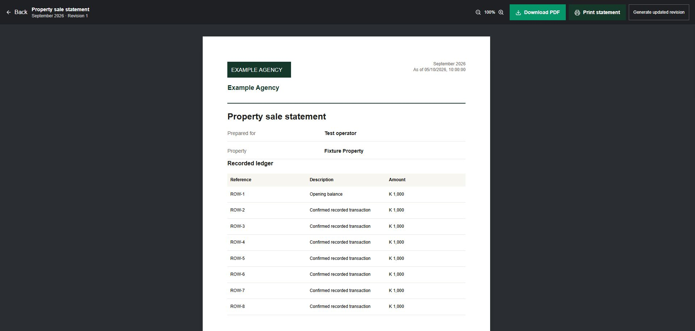

# Contour production assessment — 5 October 2026

**Verdict: FAIL for an unconditional production-ready certification.** The release fixes verified application defects and improves operational feedback. It does not establish zero bugs, exhaustive route/action coverage or recovery readiness. Source lint still fails, and material infrastructure evidence remains unavailable. Publishing the reviewed fixes to main is explicitly authorized by the user; this report is not an approval to mutate production infrastructure.

This is an independent assessment using the 13 layers published on [Matt Murphy's audit page](https://mattmurphy.ai/audit/), not a report delivered or endorsed by Matt Murphy. No external audit service received the repository or tenant data.

## Subject and scope

- Repository: Contour; branch `release/production-audit-20261005`, based on consolidated HEAD `48040e4d990a034e118c065b5a9bb8cdf2de5f10`. The release commit and main merge are discoverable from the PR containing this document.
- Existing PRs #9–#12 were merged into main before audit fixes. Their agency-logo, popup-contrast, account-menu and Closing Requirements tab changes are included.
- Inventory: 125 API route modules, one additional route module, 53 page modules and 11 loading boundaries. Inventory/build inclusion is not proof that every route works with every role and payload.
- Reviewed loading changes cover 41 dashboard/admin/Agent PWA modules and 12 additional auth/onboarding/invitation/install/vault modules, plus statement, analytics PDF, sales and capability-upload flows. Security review includes shared auth/tenant/platform boundaries, vault/storage, invitations, machine tools, property cache/public inquiries, billing, statements and sales/closing lifecycle.
- Standard security scan began before consolidation and repairs. Its initial revision identity differs from the repaired working tree. Candidate closures and focused regression evidence assess the repaired tree; they do not imply an immutable snapshot audit of every repository file.
- Production checks were read-only. No migration, financial transaction, tenant mutation, permission change, infrastructure change, destructive probe or real confidential-file exploit was performed.

## The 13 layers

| Layer | Assessment | Evidence and remaining work |
| --- | --- | --- |
| Frontend | Improved; incomplete runtime coverage | Existing skeletons retained. Immediate pending states, duplicate guards, visible failures and retry/reload added across reviewed dashboard/admin/PWA flows. Measured statement/analytics PDF page progress and upload batch progress added. No universal 500 ms timing assertion or every-action browser matrix was executed. |
| APIs & backend logic | Focused controls verified | Zod/shared handler guards; current tenant/key permissions; provider/capability transports reach route-owned authentication rather than a sign-in redirect. Historical lease relists cannot publish successor occupied inventory. Payment and offer effects are transactionally retry-safe. Full payload/role matrix remains incomplete. |
| Database & storage | Application guard fixes verified; operational proof missing | Read-only migration status reports 35 migrations and up-to-date schema. Tenant locator, folder and operation grants, object registration checks and observed MIME/size protect vault metadata. No new migration. Private bucket policy and historical public-copy/CDN quarantine remain unverified. |
| Auth & permissions | Focused regressions pass | Self-submitted roles rejected, failed member lookup denies access, verified bootstrap email required, suspended staff cannot regain access through bootstrap. Invitation capability/recipient checks and atomic single-use claims added. Machine keys require current membership, account and operation scope. |
| Hosting & deployment | Build verified; final deploy proof separate | Production build succeeds with 127 generated pages. Non-root Docker runner uses Node 22. Main publication, GitHub CI and deployed revision must be read back separately. No host/proxy mutation performed. |
| Cloud & compute | Incomplete | Live readiness reports database, Redis and object storage healthy. Capacity, CPU/memory saturation, egress/cost budget and container limits were not stress-tested. |
| CI/CD & version control | Verification jobs present; lint blocker remains | PR/typecheck/tests/build workflow retained; Node 20 replaced with Node 22 to align the supported container runtime. ESLint is still advisory in existing CI. Source lint reports 206 errors and 264 warnings; the two UI sweeps add zero diagnostics against their respective baselines. This is not a clean lint gate. |
| Security & RLS | Targeted source fixes verified; external controls unknown | Vault path/foreign-key/grant/inline-content boundaries, receipt HTML escaping, capability claims, machine scopes and cache separation hardened. No DB RLS-role probe, penetration test or complete provider/IAM review. App-level tenant predicates do not prove database policy. |
| Rate limiting | Source controls verified; distributed runtime unverified | Login/public-inquiry limits and Redis atomic machine budgets exist. Direct Dify shares IP/key/org budgets with MCP without double counting. Memory fallback is per process. Load/distributed failure-mode tests remain required. |
| Caching & CDN | Account boundary repaired | Service worker no longer caches signed-in navigation HTML and retires old cache version. Public/internal property caches include effective filters and authorization mode. CDN rules, historical cache purge and installed-client service-worker upgrade remain operational checks. |
| Load balancing & scaling | Incomplete | Reverse-proxy guidance and readiness endpoint exist. No failover, concurrent-user/soak test, p95/p99 budget or proof that multi-instance caches/quotas behave correctly under failure. |
| Error tracking & logs | Improved; incomplete | Shared API 500s no longer disclose internal exceptions; reviewed actions surface errors and release busy states. Structured/correlation logging exists. Alert delivery, retained log access/redaction and an operational error-monitoring integration are unverified. |
| Availability & recovery | Not certified | Runbook exists and current health/readiness pass. Actual PostgreSQL restore, confidential-object recovery, RPO/RTO, backup retention and rollback drill have no fresh evidence. |

Node support was checked against the [official release table](https://nodejs.org/en/about/previous-releases): Node 20 is EOL; Node 22 remains LTS.

## Application defects repaired

| Boundary | Before | Repaired behavior |
| --- | --- | --- |
| Confidential documents | Caller-controlled metadata could name local/foreign objects; sibling readers skipped folder grants; public mirrors existed | Strict tenant/category keys and realpath containment; shared folder/operation enforcement before reads/signing; private S3 uploads only; anonymous vault subtree blocked; missing originals fail explicitly |
| Document previews/uploads | Client MIME/verification/uploader data could be trusted; active inline content possible | Server HEAD supplies MIME/size; passive types only; sandbox/nosniff/no-store previews; server actor identity; new files unverified; PIN rechecked on capability upload/complete; duplicate object registration denied |
| Identity/platform access | Role input writable; bootstrap email match did not require verification; membership query fallback could grant access | Server-controlled roles, verified stored bootstrap identity, explicit active staff and fail-closed membership |
| Invitations | ID-only claims and token visibility exceeded invitation permissions; replay/member reactivation risks | Required secret and recipient checks, invite-manager visibility, atomic claim, inactive membership denial and existing-role preservation on public joining links |
| Machine exports | Key scope/current member permissions not fully enforced; grants bypassed | Operation scope plus current permissions/account/membership; vault read AND download and folder/locator checks before signing; explicit master authority validates active tenant and namespace |
| Public/catalogue/receipts | Foreign inquiry property could persist, shared cache key mixed visibility, receipt text entered HTML directly | Foreign property rejected before writes, effective-query/visibility cache identity, HTML escaping and sandboxed receipt response |
| Subscription access | Historical success/provider identity could grant indefinite recurring access | Finite ledger/legacy payment periods; explicit audited operator and lifetime grants preserved; verified trial extensions bounded by recorded expiry; discounts/status strings do not manufacture access |
| Financial retries/inventory | Checkout overwrote reservation linkage; webhook marked processed before effects; stale offer cap and old lease actions | Trusted metadata retained; settlement/offer/ledger/processed marker share transaction; atomic same-row cap and idempotent counters; successor occupied/sold/archived inventory protected |

Offline synchronization now exposes refresh/queue progress and actionable failures; retry replays pending actions while retaining unconfirmed items. Rejected HTTP responses never count as successful confirmation.

Measured work reports actual completed pages/files. Unknown-duration operations remain indeterminate; no fake percentage/time estimate was introduced. Native browser downloads do not expose reliable byte progress through fetch-based export, so generation progress does not claim OS save completion.

## Verification evidence

- `pnpm exec tsc --noEmit --pretty false`: passed, including a fresh non-incremental check. Final CI is reported separately in the release result.
- **Final full suite: 129 files passed, one skipped; 505 tests passed, one skipped.** A later concurrent Windows run passed 501 tests but timed out starting the worker for the four-test property-type suite; that suite passed separately (four tests) and immutable PR CI is required. Earlier combined runs: 471 passed/1 skipped, then two obsolete Dify test mocks failed after adding preflight limiting; mock updated without weakening the real guard. Focused storage, machine, entitlement and financial/lifecycle regressions passed.
- `pnpm build`: passed; 127 generated pages. Initial build caught a non-UTF8 statement-button source file; encoding corrected and the rerun passed. Next build skips lint/type validation, so those checks are independent.
- `pnpm exec prisma migrate status`: passed, 35 migrations applied. No schema/migration changes in this audit release.
- `pnpm audit --prod --audit-level high`: exit 0, no known runtime advisories after DOMPurify 3.4.16 and brace-expansion 1.1.21/5.0.12 security patches. Build-only `tailwindcss-animate` moved to dev dependencies. Full dependency audit was reduced from five high, two moderate and one low entries to one high entry: an unpatched `braces <=3.0.3` advisory, [GHSA-vfj7-8cjw-p6xm](https://github.com/advisories/GHSA-vfj7-8cjw-p6xm). Build-tool isolation is not a patch for that advisory.
- `pnpm exec eslint src tests`: exit 1; 206 errors/264 warnings. Historical review-recovery artifacts are excluded from lint; actual source remains checked. Known errors are explicit-any, unescaped JSX text and children-prop usage.
- Browser: refreshed production settings shows Closing Requirements fourth/API fifth. Seven authenticated dashboard navigation headings rendered with no observed alert: properties, sales, leases, pipeline, inquiries, documents, analytics. These checks precede the audit release; they do not verify newly deployed fixes.
- Local actual React statement viewer: agency logo visible, three A4 pages, progress observed advancing through pages, export/print/revision controls disabled then restored. Download-event automation timed out, but the resulting browser-saved `Property_sale_statement_doc-logo_v1.pdf` was found and opened: three A4 pages, 575,013 bytes. OS print/save-dialog completion remains unverified.
- Production `/api/health` and `/api/ready`: HTTP 200; database/Redis/objectStorage all true. Anonymous protected-route probes redirect to sign-in (307), rather than disclosing data. Redirect-following 200 sign-in responses were explicitly distinguished from API success. Invalid machine/capability transport and anonymous vault behavior require post-release checks.
- `git diff --check`: passed after formatting cleanup. Final PR CI, main SHA and deployment status belong to the final release result.

## Required follow-up before a full PASS

1. **Release/operator owner:** verify private bucket/IAM policy; determine whether historical public vault copies existed, retain authorized confidential originals, quarantine public exposure and invalidate any CDN copies. No production files were deleted during this task.
2. **Infrastructure owner:** perform a documented DB/object restore and rollback drill; record RPO/RTO, retention and monitoring delivery.
3. **Offline owner:** verify actual PowerSync rule file, verifier claims and connector permissions. The root legacy rules include broader identity/financial data than `powersync/sync-rules.yaml`; neither file's deployment was proved. Do not enable broader replication based on documentation alone.
4. **Billing owner:** verify real Lenco sandbox/provider success/failure/duplicate/retry/cancel flows and SQL concurrency semantics. Mock delegates do not establish live settlement safety. Machine arrears aging is approximate and should be reconciled with the lease ledger before treating it as a financial statement.
5. **Frontend/QA owner:** run role/device/action/error/offline browser matrix, including statement downloads and print/save, closing requirements, permissions, recipient edits and long-running failures. Add timing assertions for the 500 ms feedback requirement and real upload transfer cancellation/byte-progress where supported.
6. **Engineering owner:** remediate source lint debt and make lint a required CI gate; track the unpatched build advisory and verify runtime dependency advisories continuously.
7. **Operations owner:** execute capacity/soak/failover tests, monitor p95/p99 and failures, then verify the deployed release SHA and all dependency readiness checks.

No risk waiver or unconditional production-readiness claim was issued. Findings repaired in code and outstanding operational evidence are deliberately separated.

## Browser evidence

Actual React statement viewer using synthetic fixture data, after PDF generation restored its controls:

