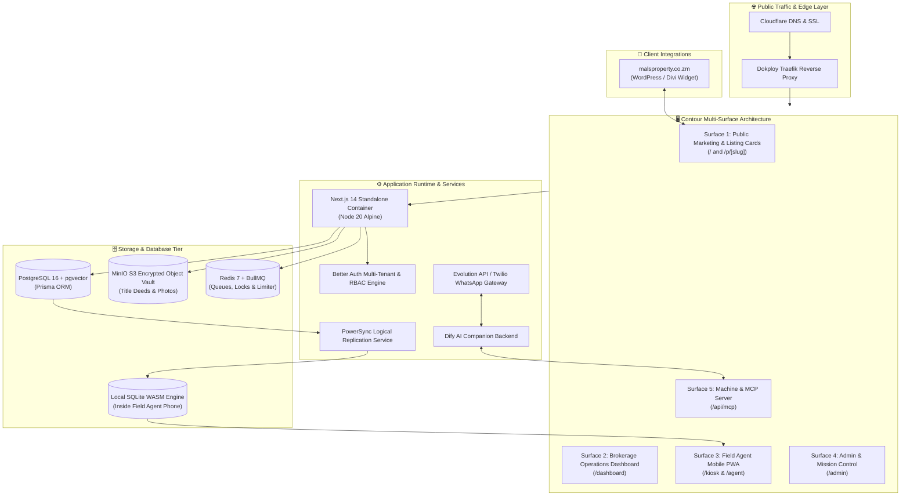

# 07.1 — Edgeless Canvas 1: System Topology & Multi-Surface Flow

> **AFFiNE Mode**: Edgeless Whiteboard Canvas  
> **How to Use**: In AFFiNE, switch to **Edgeless Mode** (Whiteboard) on this page to visualize the interactive multi-surface system topography.

---

## Interactive Topology Diagram (Mermaid)

