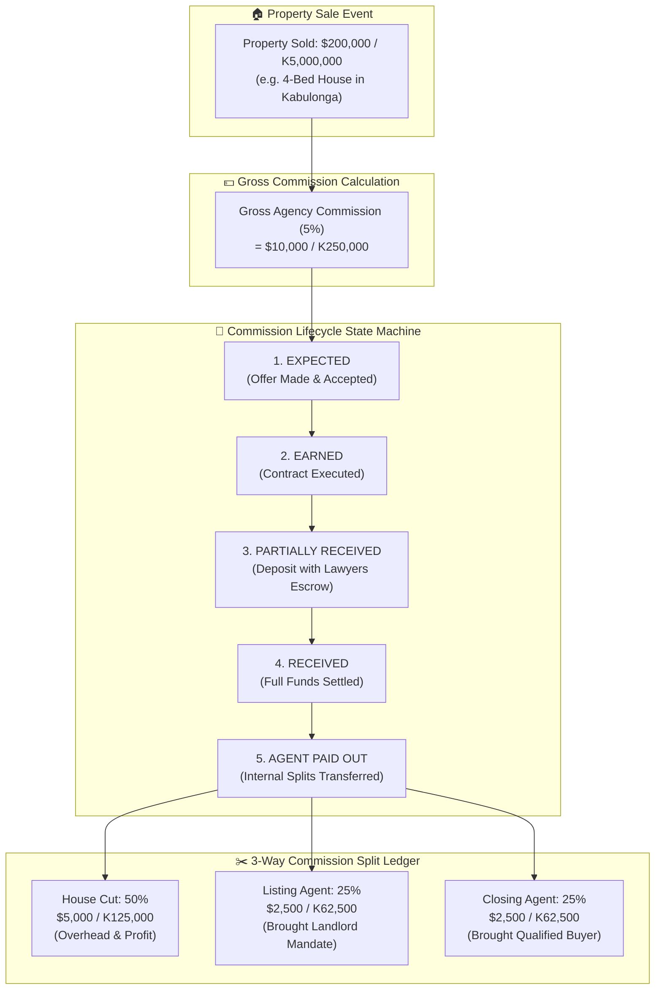

# 07.2 — Edgeless Canvas 2: Cashflow & Commission Lifecycle Diagram

> **AFFiNE Mode**: Edgeless Whiteboard Canvas  
> **How to Use**: Switch to **Edgeless Mode** to display the financial pipeline and cash flow split mechanics.

---

## Commission & Cashflow Flowchart (Mermaid)

