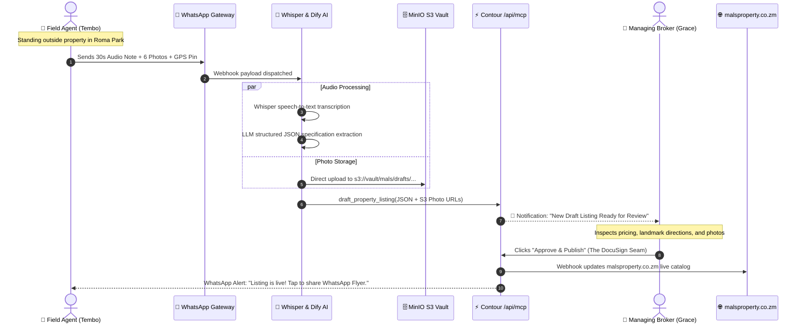

# 07.3 — Edgeless Canvas 3: Field Agent WhatsApp to Office Seam

> **AFFiNE Mode**: Edgeless Whiteboard Canvas  
> **How to Use**: Switch to **Edgeless Mode** to visualize the automated ingestion flow from field voice notes to manager approval.

---

## Field-to-Office Automation Seam (Mermaid)

