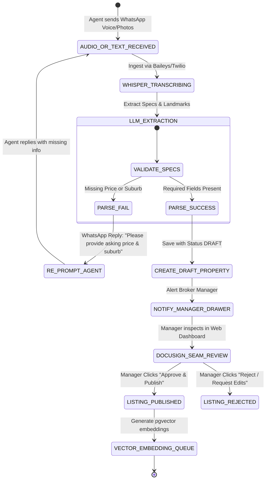
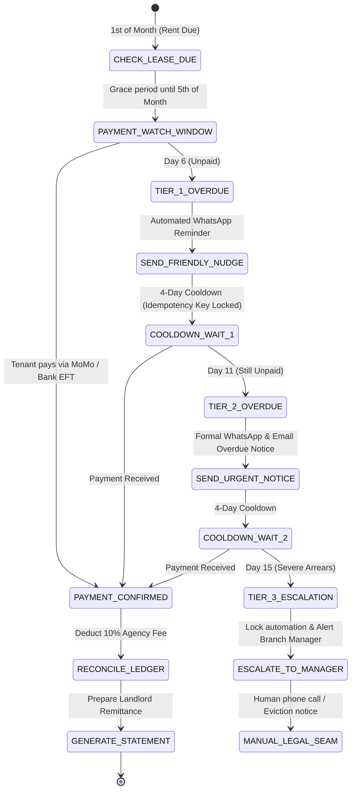

# 09 — Agentic Solutions & Systems Architecture: Contour

**Role**: Lead Systems & Agentic Solutions Architect (Banya Labs)  
**System Name**: Contour Autonomous Real Estate Operations Grid  
**Target Region**: Southern Africa (Zambia — Lusaka/Copperbelt; Zimbabwe; South Africa)  
**Status**: Production Blueprint & Scalability Architecture  

---

## 1. Executive Operational Blueprint

Contour bridges the gap between chaotic, real-world field operations (agents in traffic on WhatsApp, voice notes, physical paper lease copies, Mobile Money / Bank Transfer rent payments) and structured, high-integrity financial accounting (accurate 5% agency commissions, landlord remittance ledgers, zero-latency offline map access).

### Regional Operating Litmus Matrix:
1. **Load-Shedding & Grid Outages**: PowerSync SQLite WASM replicates the active property catalog, client locks, and offline draft queue onto the agent's mobile PWA. When 4G drops during Lusaka rolling power outages, agents can still pull up GPS coordinates, landmark directions, and property photos instantly.
2. **WhatsApp-First Ingestion**: Agents draft listings via WhatsApp voice notes (*"Tembo here, 4-bed standalone in Kabulonga, K35,000/mo, swimming pool, bore hole, opposite AIS, owner is Mr. Banda"*). Dify + Whisper transcribes, extracts structured JSON, and stages a draft listing in database.
3. **Multi-Rail Rent Reconciliation**: Tenants pay via Airtel Money, MTN MoMo, ZANACO/Stanbic EFT, or Cash. Contour ingests SMS payment proofs and bank statements via OCR, matching them against pending lease invoices with human confirmation.
4. **The DocuSign Seam (Non-Negotiable Human Sign-Off)**: AI agents calculate, draft, and escalate; **only authorized human managers can approve Landlord Remittance payouts, publish listings live, or disburse agent commission splits**.
5. **POPIA & Anti-Poaching Isolation**: Field agents receive sanitized, PII-masked property briefs. Owner phone numbers, title deeds, and bank accounts are isolated at the database level.

---

## 2. Multi-Agent Topology: Supervisor-Worker Squad

Contour deploys an orchestrated **4-Agent Operational Squad** coordinated by a central State Machine:

```
                               ┌──────────────────────────────────┐
                               │   Inbound Ingestion Channels     │
                               │ (WhatsApp Webhook, PWA, PDF Drop)│
                               └────────────────┬─────────────────┘
                                                │
                                                ▼
                               ┌──────────────────────────────────┐
                               │  Supervisor & Intent Triage Node │
                               │  (Tenant Verification & Scope)   │
                               └────────────────┬─────────────────┘
                                                │
        ┌──────────────────────────────┬────────┴─────────────────────┬──────────────────────────────┐
        ▼                              ▼                              ▼                              ▼
┌──────────────────────────┐   ┌──────────────────────────┐   ┌──────────────────────────┐   ┌──────────────────────────┐
│  Worker 1: Field Intake  │   │ Worker 2: Matchmaker Bot │   │ Worker 3: Arrears Sentry │   │ Worker 4: Statement Bot  │
│  - Audio Transcription   │   │ - Vector Similarity      │   │ - Cron Debt Aging        │   │ - Rent Ledger Deductions │
│  - Vision Photo Audit    │   │ - Natural Language Brief │   │ - Multi-Tier Nudges      │   │ - Maintenance Offsets    │
│  - GPS Landmark Resolver │   │ - 30-Day Client Lock     │   │ - Escalation Triggers    │   │ - PDF Generation         │
└────────────┬─────────────┘   └────────────┬─────────────┘   └────────────┬─────────────┘   └────────────┬─────────────┘
             │                              │                              │                              │
             └──────────────────────────────┼──────────────────────────────┴──────────────────────────────┘
                                            │
                                            ▼
                           ┌──────────────────────────────────┐
                           │   Deterministic Action Barrier   │
                           │  (Zod Schemas + Idempotency Key) │
                           └────────────────┬─────────────────┘
                                            │
                     ┌──────────────────────┴──────────────────────┐
                     ▼                                             ▼
     [Auto-Execute: Low Risk]                      [The DocuSign Seam: High Risk]
     • Vector Indexing                             • Publish Listing to Public URL
     • Draft Property Creation                     • Landlord Remittance Approval
     • WhatsApp Flyer Generation                   • Commission Split Payout
     • Tier-1 Payment Nudge                        • Human Manager Click Required
```

---

## 3. End-to-End State Machine Specifications

### A. WhatsApp Field Listing Ingestion State Machine:



### B. Rent Arrears Escalation & Cooldown State Machine:



---

## 4. Multi-Rail Financial Payment Reconciliation Engine

### Ingestion Rails & Parsing Rules:
1. **Airtel Money & MTN MoMo SMS / Webhook**:
   - Matches Transaction ID (e.g. `MP260818.1345.H12345`), sender phone number, and exact Kwacha amount against active `Lease` records.
   - Status transitions to `CONFIRMED` upon exact amount match; flags `PENDING_VERIFICATION` if underpaid.
2. **Bank EFT (ZANACO, Stanbic, FNB, ABSA)**:
   - PDF Statement OCR Parser extracts `Date`, `Description/Ref` (e.g. `RENT KABULONGA PLOT 24`), and `Credit Amount`.
   - Fuzzy matches description against `Property.title`, `Lease.tenantName`, and `Lease.tenantIdNumber`.
3. **Cash / Cheque Physical Receipts**:
   - Field agent or cashier records receipt number, uploads photo of paper receipt, and triggers manager verification.

---

## 5. Offline PowerSync & SQLite Client Synchronization

```yaml
# PowerSync sync_rules.yaml
bucket_definitions:
  user_properties:
    parameters:
      - select organization_id from member where user_id = request.user_id()
    data:
      - select * from property where organization_id = bucket.organization_id and status in ('AVAILABLE', 'UNDER_OFFER')
      - select id, title, asking_price, rental_price, currency, suburb, latitude, longitude, landmark_directions, photos from property where organization_id = bucket.organization_id
      - select id, client_name, client_phone, looking_for, budget_min, budget_max, preferred_suburbs from inquiry where assigned_agent_id = request.user_id()

# Invariant: Landlord sensitive PII (owner_phone, owner_bank_details) is NEVER synced to client SQLite WASM!
```

---

## 6. Failure Recovery, Idempotency & Dead-Letter Queue (DLQ)

1. **Idempotency Keys on All Actions**:
   - Inbound WhatsApp messages are keyed with `hash(sender_phone + message_id)`.
   - Rent reminder jobs are keyed with `arrears-${leaseId}-${periodYear}-${periodMonth}-tier${tier}` to make accidental duplicate messages physically impossible.
2. **Exponential Backoff & Circuit Breaking**:
   - Outbound WhatsApp notifications retry max 3 times with exponential backoff (`30s`, `2m`, `10m`).
   - If WhatsApp gateway is down, notifications fall back to Email / SMS, and write to `DeadLetterQueue`.
3. **Chatwoot `[HANDOFF]` Human Fallback**:
   - If an automated conversation with a tenant or prospective buyer encounters ambiguity, frustration, or 3 failed intent matches, the system emits `[HANDOFF]` and routes the live conversation to the assigned agent's mobile dashboard.

---

## 7. The DocuSign Seam: Governance & Authorizations

| Action | Automated Agent Capabilities | Human-in-the-Loop Requirement (The Seam) |
| :--- | :--- | :--- |
| **Listing Creation** | Transcribes audio, extracts specs, formats photos, generates description. | **Broker Manager must click "Approve & Publish"** before listing goes live or public link activates. |
| **Rent Collection & Receipts** | Ingests bank SMS/proof, reconciles ledger, generates digital receipt. | Automated for exact matches; human approval required for partial payments or unreferenced deposits. |
| **Landlord Monthly Statement** | Reconciles rent, deducts 10% agency fee, subtracts maintenance costs. | **Finance Officer / Manager must click "Authorize Remittance"** before PDF is emailed/WhatsApped to Landlord. |
| **Agent Commission Payout** | Calculates 50% split of earned agency fee. | **Managing Director must authorize bank transfer / MoMo payout**. |
